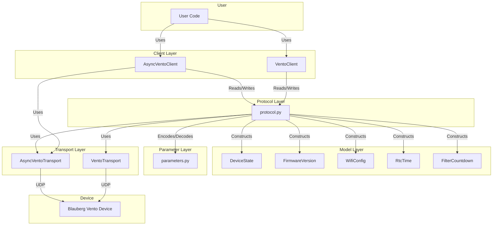

# Blauberg Vento Protocol Library - Architecture Overview

## **Introduction**

This library provides a Python interface for interacting with **Blauberg Vento ventilation devices** using their openly available protocol. It supports both **synchronous** and **asynchronous** communication, device discovery, and comprehensive parameter control.

---

## **Architecture**

The library is organized into the following layers:

### 1. **Transport Layer** (`transport.py`)

- Handles **UDP communication** with devices.
- Provides synchronous (`VentoTransport`) and asynchronous (`AsyncVentoTransport`) implementations.
- Supports **device discovery** via UDP broadcast.

### 2. **Protocol Layer** (`protocol.py`)

- Implements **packet encoding/decoding** for the Blauberg Vento protocol.
- Constructs packets for **read**, **write**, **increment**, and **decrement** operations.
- Parses responses into structured data (e.g., `Param` → `bytes` mappings).
- Includes **checksum verification** and error handling for malformed packets.

### 3. **Parameter Layer** (`parameters.py`)

- Defines all **protocol parameters** (`Param` enum) and their metadata (e.g., size, read/write permissions).
- Provides helper functions to check parameter properties (e.g., `is_readable`, `is_writable`).
- Maps parameters to human-readable descriptions and valid value ranges.

### 4. **Model Layer** (`models.py`)

- Defines **dataclasses** for structured device data (e.g., `DeviceState`, `FirmwareVersion`, `WifiConfig`).
- Includes helper classes for parsing raw data (e.g., `RtcTime`, `FilterCountdown`).
- Aggregates device state into a single object (`DeviceState`) for easy access.

### 5. **Client Layer** (`client.py`)

- Provides **high-level clients** (`VentoClient`, `AsyncVentoClient`) for device interaction.
- Implements methods for:
  - Reading/writing parameters (e.g., `read_params`, `write_params`).
  - Controlling device state (e.g., `turn_on`, `set_speed`, `set_mode`).
  - Configuring timers, sensors, Wi-Fi, and maintenance settings.
  - Discovering devices on the network (`discover` method).
- Uses `_DeviceStateBuilder` to construct `DeviceState` from raw parameter data.

### 6. **Exception Layer** (`exceptions.py`)

- Defines **custom exceptions** for error handling (e.g., `VentoTimeoutError`, `VentoProtocolError`).
- Organized hierarchically under `VentoError` for consistent error handling.

---

## **Architecture Diagram**



---

## **Key Features**


| Feature                 | Description                                                               |
| ----------------------- | ------------------------------------------------------------------------- |
| **Device Discovery**    | Discover Blauberg Vento devices on the local network via UDP broadcast.   |
| **Parameter Control**   | Read/write parameters (e.g., power, speed, timers, sensors, Wi-Fi).       |
| **State Management**    | Retrieve and update the full device state (`DeviceState`).                |
| **Async Support**       | Non-blocking operations via `AsyncVentoClient` and `AsyncVentoTransport`. |
| **Error Handling**      | Comprehensive exceptions for connection, protocol, and parameter errors.  |
| **Protocol Compliance** | Follows Blauberg's openly available protocol documentation.               |


---

## **When to Use `VentoClient` vs. `AsyncVentoClient`**

### **Use `VentoClient` (Synchronous) When:**

- You are writing **synchronous scripts** or applications where blocking operations are acceptable.
- You need **simple, straightforward** interactions with the device.
- Your application does **not** require high concurrency or parallelism.
- You are working in a **single-threaded environment** where async/await syntax is unnecessary.

**Example Use Cases:**

- CLI tools for one-off device configuration.
- Simple automation scripts (e.g., turning devices on/off at specific times).
- Testing or debugging device interactions.

**Example:**

```python
from blauberg_vento import VentoClient

# Synchronous usage
client = VentoClient(host="192.168.1.100", device_id="DEVICE_ID", password="1111")
state = client.get_state()  # Blocks until response is received
print(f"Power: {'ON' if state.power else 'OFF'}")
client.turn_on()  # Blocks until command is sent
```

---

### **Use `AsyncVentoClient` (Asynchronous) When:**

- You are building **high-performance applications** that need to handle multiple devices or tasks concurrently.
- You want to **avoid blocking** the main thread (e.g., in web servers, GUIs, or real-time systems).
- Your application uses **`asyncio`** or other asynchronous frameworks.
- You need to **scale** to many devices or frequent interactions without latency.

**Example Use Cases:**

- Integration in Home Assistant
- Web applications (e.g., Flask/FastAPI) that need to serve multiple requests simultaneously.
- Real-time monitoring systems that poll multiple devices.
- Applications integrating with other async libraries (e.g., databases, HTTP clients).

**Example:**

```python
import asyncio
from blauberg_vento import AsyncVentoClient


async def monitor_device():
    async with AsyncVentoClient(host="192.168.1.100", device_id="DEVICE_ID") as client:
        state = await client.get_state()  # Non-blocking: allows other tasks to run
        print(f"Power: {'ON' if state.power else 'OFF'}")
        await client.turn_on()  # Non-blocking


# Run multiple device interactions concurrently
async def main():
    devices = [
        ("192.168.1.100", "DEVICE_1"),
        ("192.168.1.101", "DEVICE_2"),
    ]
    tasks = [monitor_device(device[0], device[1]) for device in devices]
    await asyncio.gather(*tasks)  # Runs concurrently


asyncio.run(main())
```

---

## **Supported Parameters**


| **Parameter**        | **Description**          | **Readable** | **Writable** | **Size (bytes)** | **Valid Values/Ranges**                                   |
| -------------------- | ------------------------ | ------------ | ------------ | ---------------- | --------------------------------------------------------- |
| `POWER`              | Unit On/Off              | Yes          | Yes          | 1                | 0: Off, 1: On, 2: Invert                                  |
| `SPEED`              | Speed number             | Yes          | Yes          | 1                | 1: Speed 1, 2: Speed 2, 3: Speed 3, 255: Manual           |
| `BOOST_STATUS`       | Boost status             | Yes          | No           | 1                | 0: Off, 1: On                                             |
| `TIMER_MODE`         | Timer mode               | Yes          | Yes          | 1                | 0: Off, 1: Night, 2: Party                                |
| `TIMER_COUNTDOWN`    | Timer countdown          | Yes          | No           | 3                | N/A                                                       |
| `HUMIDITY_SENSOR`    | Humidity sensor          | Yes          | Yes          | 1                | 0: Off, 1: On, 2: Invert                                  |
| `RELAY_SENSOR`       | Relay sensor             | Yes          | Yes          | 1                | 0: Off, 1: On, 2: Invert                                  |
| `VOLTAGE_SENSOR`     | 0-10V sensor             | Yes          | Yes          | 1                | 0: Off, 1: On, 2: Invert                                  |
| `HUMIDITY_THRESHOLD` | Humidity threshold (%RH) | Yes          | Yes          | 1                | 40-80                                                     |
| `VOLTAGE_THRESHOLD`  | 0-10V threshold (%)      | Yes          | Yes          | 1                | 5-100                                                     |
| `BATTERY_VOLTAGE`    | Battery voltage (mV)     | Yes          | No           | 2                | 0-5000                                                    |
| `CURRENT_HUMIDITY`   | Current humidity (%RH)   | Yes          | No           | 1                | 0-100                                                     |
| `VOLTAGE_SENSOR_VAL` | 0-10V value (%)          | Yes          | No           | 1                | 0-100                                                     |
| `RELAY_STATE`        | Relay state              | Yes          | No           | 1                | 0: Off, 1: On                                             |
| `HUMIDITY_STATUS`    | Humidity status          | Yes          | No           | 1                | 0: Below, 1: Over                                         |
| `VOLTAGE_STATUS`     | 0-10V status             | Yes          | No           | 1                | 0: Below, 1: Over                                         |
| `MANUAL_SPEED`       | Manual speed (0-255)     | Yes          | Yes          | 1                | 0-255                                                     |
| `FAN1_SPEED`         | Fan 1 speed (rpm)        | Yes          | No           | 2                | 0-5000                                                    |
| `FAN2_SPEED`         | Fan 2 speed (rpm)        | Yes          | No           | 2                | 0-5000                                                    |
| `FILTER_COUNTDOWN`   | Filter countdown         | Yes          | No           | 3                | N/A                                                       |
| `FILTER_RESET`       | Reset filter timer       | No           | Yes          | 1                | N/A                                                       |
| `FILTER_INDICATOR`   | Filter indicator         | Yes          | No           | 1                | 0: OK, 1: Replace                                         |
| `BOOST_DELAY`        | Boost delay (0-60 min)   | Yes          | Yes          | 1                | 0-60                                                      |
| `RTC_TIME`           | RTC time                 | Yes          | Yes          | 3                | N/A                                                       |
| `RTC_CALENDAR`       | RTC calendar             | Yes          | Yes          | 4                | N/A                                                       |
| `WEEKLY_SCHEDULE_EN` | Weekly schedule          | Yes          | Yes          | 1                | 0: Off, 1: On, 2: Invert                                  |
| `SCHEDULE_SETUP`     | Schedule setup           | Yes          | Yes          | 6                | N/A                                                       |
| `DEVICE_SEARCH`      | Device search/ID         | Yes          | No           | 16               | N/A                                                       |
| `DEVICE_PASSWORD`    | Device password          | Yes          | Yes          | N/A              | N/A                                                       |
| `MACHINE_HOURS`      | Machine hours            | Yes          | No           | 4                | N/A                                                       |
| `RESET_ALARMS`       | Reset alarms             | No           | Yes          | 1                | N/A                                                       |
| `ALARM_STATUS`       | Alarm status             | Yes          | No           | 1                | 0: No alarm, 1: Alarm, 2: Warning                         |
| `CLOUD_PERMISSION`   | Cloud permission         | Yes          | Yes          | 1                | 0: Off, 1: On, 2: Invert                                  |
| `FIRMWARE_VERSION`   | Firmware version         | Yes          | No           | 6                | N/A                                                       |
| `FACTORY_RESET`      | Factory reset            | No           | Yes          | 1                | N/A                                                       |
| `WIFI_MODE`          | Wi-Fi mode               | Yes          | Yes          | 1                | 1: Client, 2: AP                                          |
| `WIFI_SSID`          | Wi-Fi SSID               | Yes          | Yes          | N/A              | N/A                                                       |
| `WIFI_PASSWORD`      | Wi-Fi password           | Yes          | Yes          | N/A              | N/A                                                       |
| `WIFI_ENCRYPTION`    | Wi-Fi encryption         | Yes          | Yes          | 1                | 48: OPEN, 50: WPA\_PSK, 51: WPA2\_PSK, 52: WPA\_WPA2\_PSK |
| `WIFI_CHANNEL`       | Wi-Fi channel            | Yes          | Yes          | 1                | 1-13                                                      |
| `WIFI_DHCP`          | Wi-Fi DHCP               | Yes          | Yes          | 1                | 0: Static, 1: DHCP, 2: Invert                             |
| `WIFI_IP`            | Wi-Fi IP                 | Yes          | Yes          | 4                | N/A                                                       |
| `WIFI_SUBNET`        | Wi-Fi subnet             | Yes          | Yes          | 4                | N/A                                                       |
| `WIFI_GATEWAY`       | Wi-Fi gateway            | Yes          | Yes          | 4                | N/A                                                       |
| `WIFI_APPLY`         | Apply Wi-Fi config       | No           | Yes          | 1                | N/A                                                       |
| `WIFI_DISCARD`       | Discard Wi-Fi config     | No           | Yes          | 1                | N/A                                                       |
| `WIFI_CURRENT_IP`    | Current Wi-Fi IP         | Yes          | No           | 4                | N/A                                                       |
| `OPERATION_MODE`     | Operation mode           | Yes          | Yes          | 1                | 0: Ventilation, 1: Heat Recovery, 2: Supply               |
| `UNIT_TYPE`          | Unit type                | Yes          | No           | 2                | 3: A50/A85/A100 V.2, 4: Duo A30 V.2, 5: A30 V.2           |
| `NIGHT_TIMER`        | Night timer              | Yes          | Yes          | 2                | N/A                                                       |
| `PARTY_TIMER`        | Party timer              | Yes          | Yes          |                  |                                                           |